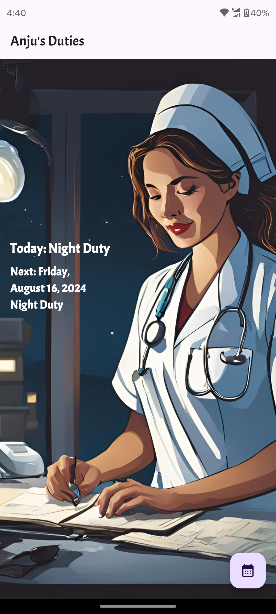
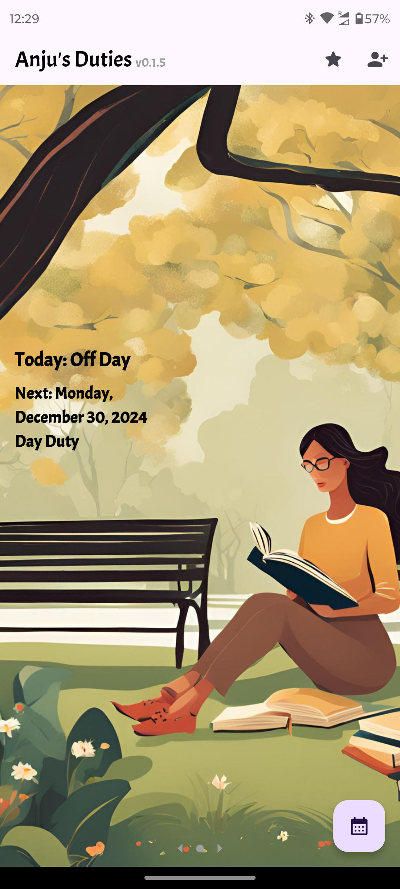
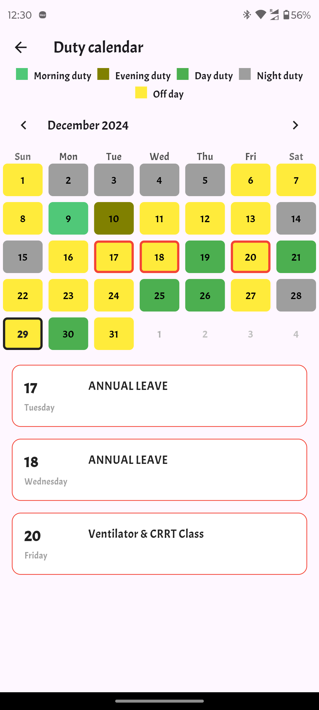

# Anju's Duties 📅

Welcome to **Anju's Duties** – a simple app designed to help in-laws easily view their daughter's duty schedule. All made possible by their loving son-in-law (that's me 😉).


## 🎯 Project Overview

This app fetches duty schedules directly from a Google Sheet and displays them in a user-friendly manner. The data is kept in sync with the Google Sheet, making it easy to update and view schedules.

## 🛠️ Getting Started

To set up the app, you'll need a Google Sheets API key and the ID of the Google Sheet where the duty schedules are stored. These are stored in the `.env` file in the root directory.

### Step 1: Get the Google Sheet ID

1. Open the Google Sheet containing the duty schedules.
2. The URL of your Google Sheet looks something like this:

````
https://docs.google.com/spreadsheets/d/<<sheet-id>>/edit#gid=0
````
3. Copy the portion between `/d/` and `/edit#`, which is the **Sheet ID**.

### Step 2: Get Your Google Sheets API Key

1. Go to the [Google Cloud Console](https://console.cloud.google.com/).
2. Create a new project or select an existing project.
3. Navigate to **APIs & Services** > **Credentials**.
4. Click **Create Credentials** and choose **API Key**.
5. Copy the generated **API Key**.

### Step 3: Set Up the `.env` File

1. In the root directory of your project, create a file named `.env`.
2. Add your **Sheet ID** and **API Key** like this:
SHEET_ID=your_google_sheet_id_here
API_KEY=your_google_api_key_here

## 🚀 Usage
Once you've set up your .env file with the required credentials, you're all set! Run the app using the following command:

```bash
flutter run
```

The app will fetch the duty schedule from the Google Sheet and display it in a beautiful format.

## 📸 Screenshots

Here's a sneak peek of what Anju's Duties looks like:






## 🤝 Contributing

Want to make Anju's Duties even better? You're welcome to contribute!

Fork the repo.
Create a new branch (git checkout -b feature/amazing-feature).
Commit your changes (git commit -m 'Add some amazing feature').
Push to the branch (git push origin feature/amazing-feature).
Open a Pull Request.

## 📄 License

This project is licensed under the MIT License.

## ❤️ A Special Note

This app was made with love, especially for my in-laws, to keep everything on track and make life a little easier. 😉