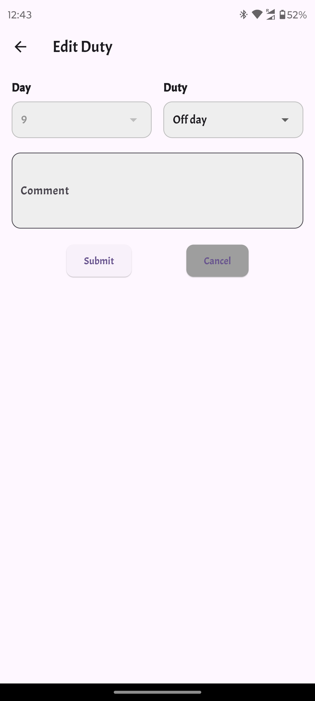
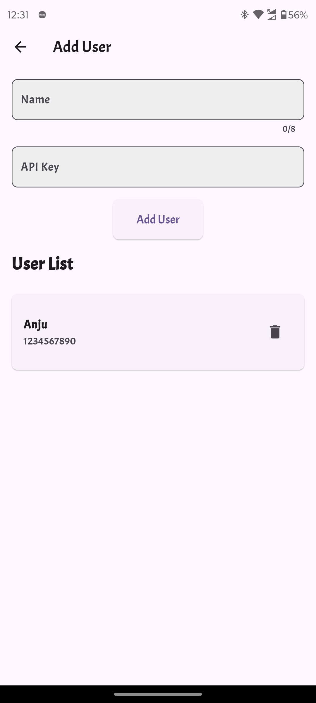

# DutyLog 📅

Welcome to **DutyLog** – a simple and intuitive app designed to help users easily manage and view duty schedules. Initially created as a heartfelt gesture for my in-laws to  easily view their daughter's duty schedule, the app is now multi-user friendly, making it perfect for anyone needing to organize and track schedules effortlessly.


## 🎯 Project Overview

DutyLog fetches duty schedules directly from Google Sheets and displays them in a user-friendly interface. Each user can register their own Google Sheet, ensuring personalized schedule management. Updates made in the Google Sheet are reflected in real time within the app.

## 🛠️ Getting Started

To set up the app, you’ll need a Google Sheets API key. Users will input their Google Sheet ID while registering within the app.

### Step 1: Get Your Google Sheets API Key

1. Go to the [Google Cloud Console](https://console.cloud.google.com/).
2. Create a new project or select an existing project.
3. Navigate to **APIs & Services** > **Credentials**.
4. Click **Create Credentials** and choose **API Key**.
5. Copy the generated **API Key**.

### Step 2: Share the Google Sheet with the API Service Account

1. In the [Google Cloud Console](https://console.cloud.google.com/), go to APIs & Services > Credentials.
2. Locate your API Key and find the associated service account email (it looks like your-project-id@developer.gserviceaccount.com).
3. Open the Google Sheet you want to use.
4. Click Share in the top right corner.
5. Add the service account email with Editor access.
6. Copy the portion between `/d/` and `/edit#` in Google Sheet URL, which is the **Sheet ID**.
````
https://docs.google.com/spreadsheets/d/<<sheet-id>>/edit#gid=0
````
We need to configure the sheet id in the Add user screen of the App as API key

### Step 3: Set Up the `.env` File

1. In the root directory of your project, create a file named `.env`.
2. Add your **API Key** like this:

````
API_KEY=your_google_api_key_here
````

## 🚀 Usage
Once you've set up your .env file with the required credentials, you're all set! Run the app using the following command:

```bash
flutter run
```

Before using the app, configure it by providing your name and Google Sheet ID in the Add User page:

1. Open the app and navigate to the Add User page.
2. Enter your Name (this will be displayed at the top of the app).
3. Enter the API key (which is the Google Sheet ID for fetching your schedules).

Once configured, you’re ready to use DutyLog! The app will fetch the duty schedule from the registered Google Sheet and display it beautifully.

## 📸 Screenshots

Here's a sneak peek of what DutyLog looks like:

<div style="display: flex; gap: 10px;">
   
   
   
   
   
   
</div>

## 🤝 Contributing

Want to make DutyLog even better? You're welcome to contribute!

- Fork the repo.
- Create a new branch (git checkout -b feature/amazing-feature).
- Commit your changes (git commit -m 'Add some amazing feature').
- Push to the branch (git push origin feature/amazing-feature).
- Open a Pull Request.

## 📄 License

This project is licensed under the MIT License.

## ❤️ A Special Note

DutyLog started as a project to simplify my wife's duty schedule tracking for my in-laws and has now grown into a versatile tool for anyone who needs organized scheduling. Whether for personal or professional use, it’s built with love to make life a little easier for everyone!